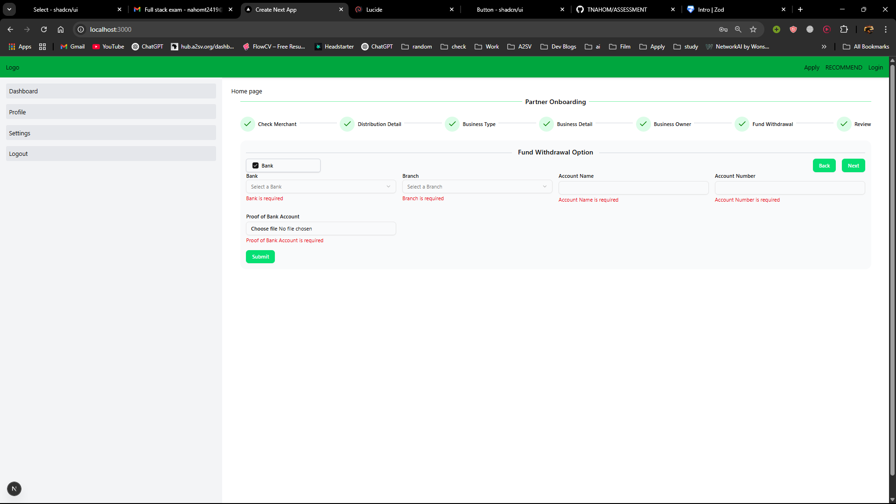
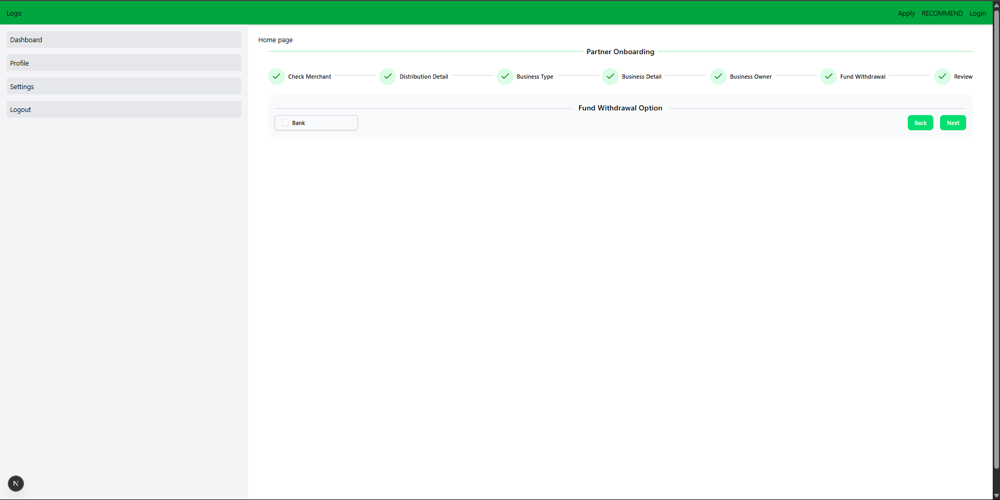

# SafariCom frontend Assessment

This repository contains the assessment project for SafariCom. Below are the images and details of the project.

Built with Next.js and strict TypeScript for type-safe development. Utilized Zod for precise form validation. Styled the UI using TailwindCSS and shadcn/ui for a clean and accessible user experience.

---

## Project Screenshots

### Login Page

### Detail Page

### Onboarding Page

### Review Page

---
